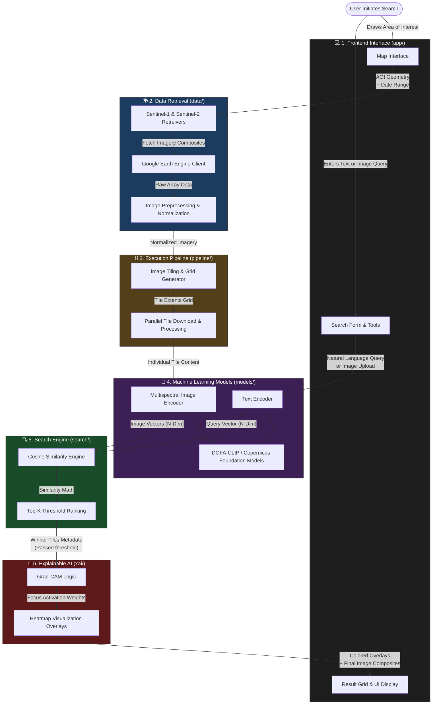

# EmbeddedEarth: Architectural Overview & App Map

## What is EmbeddedEarth?

EmbeddedEarth is an AI-powered semantic search engine designed for Earth Observation (EO) satellite imagery. Utilizing multimodal Vision-Language Models like DOFA-CLIP (Dynamic One-For-All CLIP), the tool allows users to find specific geographic features or patterns simply by typing natural language descriptions (e.g., "industrial facility near river" or "circular irrigation pivots") or by using a reference image. Under the hood, the application interacts with Google Earth Engine to fetch multi-spectral imagery (Sentinel-1 or Sentinel-2) for a user-drawn Area of Interest. The pipeline divides this area into manageable tiles, computes embeddings for each, and mathematically ranks them against the query representation using cosine similarity. To build user trust, the application features an Explainable AI (XAI) component that generates Grad-CAM heatmaps on top of the search results, transparently highlighting the exact visual areas that drove the AI's conclusions. The entire experience is accessible via an interactive, browser-based Streamlit interface.

## App Map

The following Mermaid diagram maps out the core directories in the repository alongside their functional role in the user's journey.

### Flow Walkthrough

1. **`app/`**: Facilitates user interaction via a Streamlit dashboard. Collects the search parameters (what the user is looking for) and the bounding geographic area over a map.
2. **`data/`**: Bridges the application with Google Earth Engine to download multi-spectral data composites that fall strictly within the user's bounding box and date ranges. 
3. **`pipeline/`**: The system divides the massive geographical extent intelligently into a parallelized grid, meaning it chops up the region and delegates downloads and processing via a threading pool. 
4. **`models/`**: Converts both the downloaded image tiles and the user's initial search query into multi-dimensional numeric vectors (embeddings) using advanced Vision-Language Models capable of reading satellite bands.
5. **`search/`**: Compares the user query vector against thousands of image vectors looking for the closest mathematical distance (cosine similarity). It removes tiles falling below specific similarity thresholds.
6. **`xai/`**: Takes the highest-scoring tiles and "looks closely" to see *why* the model scored them highly, generating heatmap highlights which are finally passed back to the `app/` rendering engine for the user.

## Token Efficiency Rules

### Response Style
- Don't repeat back what I asked you to do.
- Don't explain standard operations (file reads, grep, running tests).
- DO explain non-obvious decisions, tradeoffs, or assumptions.
- Keep summaries to one line after changes unless the change was complex.
- NEVER narrate between tool calls. No "Let me check...",
  "Now let me...", "Looking back at...", "I'll now...".
  Just call the tool silently.
- Don't think out loud. Don't describe your reasoning process
  step-by-step. Just do the work and report results.
- If you need to call multiple tools in sequence,
  call them without commentary between each one.

### File Operations
- Prefer Edit over Write for existing files. Only use Write for new files.
- Make targeted, surgical edits. Don't replace large blocks for small changes.
- Read specific line ranges instead of whole files when you know exactly
  what you need — but read the full file when you need surrounding context
  for correct edits.

### Command Output
- Pipe verbose test output through `tail -50` or `grep -A 5 "FAIL"`
  when you expect a single failure. For multi-failure runs, increase the
  line count or use `grep -B 2 -A 5 "FAIL\|ERROR"` to catch all failures.
- For builds: redirect to file, only show output on failure.
- Never `cat` large files - use `head`, `tail`, or line ranges.
- When running linters/formatters, pipe through `head -30`.

### Agent Usage
- Don't spawn sub-agents for simple tasks. Do it directly.

### General
- Don't re-read files already in context.
- Use .claudeignore to exclude generated files, build artifacts, lock files.